# 🟦🌧️ Sweatin'SkyBlue

"우울증은 구름일 수 있지만, 당신은 하늘입니다."
 
"구름이 하늘을 지배하는 것처럼 보일 때도, 하늘은 여전히 하늘로 남아 있습니다. 구름은 결국 흘러가지만 하늘은 그 자리에 있습니다. 당신이 우울증보다 크다는 것, 그것이 당신 안에서 작동할 뿐 당신이 그 안에서 작동하는 것이 아니라는 것"
 
뛰며 땀으로 구름을 걷어내는 뜻으로 이 이름을 지었습니다.

---

## 📖 목차

- [프로젝트 소개](#-프로젝트-소개)
- [핵심 기능](#-핵심-기능)
- [기술 스택](#-기술-스택)
- [주요 화면](#-주요-화면)
- [알려진 이슈](#-알려진-이슈)

---

## 💡 프로젝트 소개
**개발 기간**: 2025.11.25 ~ 2025.12.02 (8일)

### 왜 이 서비스를 만들었나요?

#### 🚧 문제 1: 치료 자원 접근성 격차

**현황:**
- 가장 치료가 필요한 사람들이 가장 치료받기 어려운 현실 (예: 가정 "대표환자"인 청소년, 저소득층)
- 긴 대기시간, 높은 비용, 중산층에게 그래도 감당하는 약물 부작용이 저소득층이나 사회적 약자에게는 파괴적일 수 있음
- 운동은 간단하게 보이지만 사실상 아주 강력한 항우울 솔루션, 많은 연구에서 운동을 우울증 핵심 치료법으로 권고

**서비스 설계:**
- 효과적이고 저렴하며 접근 가능한 솔루션 제공
- 일상 생산활동에 지장이 없어야 함

**해결책:** 조깅 - 강력한 항우울 효과, 저렴함, 접근성 높음, 햇빛 노출

---

#### 😔 문제 2: 우울증의 일상 침투

**현황:**
- 우울증은 행동 능력을 약화시키고 실패는 무력감을 심화
- 조기 기상, 부정적 인지를 활용 가능한 "자원"으로 전환될 수도 있음

**서비스 설계:** 우울증 환자의 특성에 맞춰 개인의 심리적 투여를 최소화

**해결책:** 릴레이 조깅 - 이전 주자 도착해야 다음 주자 출발 (강제성 + 탈락 방지)

---

#### 🏥 문제 3: 과도한 의료화와 낙인

**현황:**
- "왜 이렇게 되었는가"에만 집중하고 "당신은 누구인가"는 무시
- 낙인 두려움으로 도움 요청 어려움, 주변 사람도 낙인 때문에 조심스러워 함
- [개인 경험] 상담 영역 종사자들은 대부분 사회가 정의하는 "정상"의 혜택을 누리며 살아온 사람들이지만, 환자는 정반대
- [개인 경험] 어떤 원인으로 사회가 원활한 소통을 위해 "정상"의 기준을 명확히 하고 의료화가 과도해지는 동시에 사람들을 유형화하려 함. 그러나 인간은 매우 복잡한 존재로서 각자 독특하고 심오한 사고, 욕구, 성격, 행동 패턴을 지니고 있으며, 이러한 복잡함 자체가 가치 있음

**서비스 설계:**
- 비슷한 경험을 가진 사람들을 모아 심리적 부담 감소
- 부정적 감정과 행동을 수용할 수 있는 공간 제공
- 자연스러운 조건에서 사회 활동 제공 (사회적 교류가 주목적 아님)
- 인지적 부담 감소, 충분한 선택의 자유 제공

**해결책:**
- 비슷한 경험을 가진 사람들과 함께 심리적 부담 감소
- 익명 트리홀 기능으로 부정적 감정 수용 공간 제공
- 자연스러운 사회 활동 제공 (사회 교류가 주목적 아님)
- 어떠한 인지적/이념적 틀도 제공하지 않음

---

### 🎯 핵심 원칙

✅ **효과적이고 저렴하며 접근 가능**  
✅ **정상적인 생활을 방해하지 않음**  
✅ **환자 특성에 맞춤**  
✅ **선택의 자유와 자율성 존중**

---

## 🚀 핵심 기능

### 1. 🏃 릴레이 조깅 시스템

#### 릴레이 방식
- **이전 주자**가 중간 지점 도착 → **다음 주자**와 합류 → 릴레이 버튼
- 버튼 누르는 순간: 다음 사람 타이머 시작, 두 사람이 함께 달림
- 다음 사람이 버튼 누를 때 이전 사람 임무 완료

#### 역할 변화
- **전반부**: 나는 주자, 이전 사람이 동반자
- **후반부**: 나는 동반자, 다음 사람이 주자

#### 팀장 권한
- 릴레이 과정 직접 제어
- **Skip 기능**: 특정 인원 건너뛰어 다음 사람에게 영향 주지 않음
- 시간 내 완료 못한 사람 → 완료율 하락

---

### 2. 📝 커뮤니티 (3개 구역 피드)

#### 운동 구역
- 달리기 후 운동 기록 공유
- **함께 달린 사람** 자동 표시

#### 일상 구역
- 일상 생활 자유롭게 공유

#### 발산 구역
- **익명 트리홀** - 부정적 감정 배출 공간
- 낙인 없이 감정 표현 가능

#### 피드 기능
- 좋아요, 댓글, 북마크
- 지역/구역/팀원 동태별 필터링
- 검색 기능

---

### 3. 👥 팀 관리

#### 팀 생성 (팀장)
- **자격 조건**: 이전 코스 90% 이상 완료율 (신용도 양호)
- **직접 설계**: 경로, 강도, 시간, 최대 인원
- **구간 배정**: 각 팀원에게 담당 구간 할당

#### 팀 가입 (팀원)
- **필터링**: 지역(구 단위), 강도별 검색
- **신청서 작성**: 건강 상태, 직업, 신청 이유, 희망 구간
- **승인/거절**: 팀장 검토 후 결정

---

### 4. 💬 실시간 채팅

#### 팀 채팅
- 팀 모집 완료 후 자동 생성
- 릴레이 중 소통

#### 1:1 채팅
- 다른 사용자 프로필에서 메시지 버튼
- 실시간 대화

---

### 5. 🔔 알림 시스템

- 좋아요, 댓글, 팔로우 알림
- 팀 가입 신청/승인 알림
- 릴레이 차례 알림

---

### 6. 👤 개인 프로필

- **팔로우/팔로워** 시스템
- **완료율** 표시 (신용도 지표)
- **내 팀** / **가입된 팀** 조회
- **저장한 피드** 모아보기

---

## 🔧 기술 스택

**개발 기간**: 2025.11.25 ~ 2025.12.02 (8일)

### Frontend

| 기술명 | 설명 |
|--------|------|
|  | React 18.3.1 - 최신 React 기능을 활용한 컴포넌트 기반 개발 |
|  | Material-UI 6.1.5 - 일관된 UI 컴포넌트 라이브러리 |
|  | React Router 6.27.0 - 클라이언트 사이드 라우팅 |
|  | Socket.io-client 4.8.1 - 실시간 채팅 WebSocket 클라이언트 |
|  | jwt-decode 4.0.0 - JWT 토큰 디코딩 |

### Backend

| 기술명 | 설명 |
|--------|------|
|  | Node.js 24.11.1 - 비동기 이벤트 기반 서버 런타임 |
|  | Express 5.1.0 - 간결한 웹 프레임워크 |
|  | MySQL 8.0 - 관계형 데이터베이스 |
|  | Socket.io 4.7.2 - 실시간 채팅 WebSocket 서버 |
|  | JWT 9.0.2 - 토큰 기반 인증 |
|  | bcrypt 6.0.0 - 비밀번호 해싱 (saltRounds: 10) |
|  | Multer 2.0.2 - 파일 업로드 처리 |

### 외부 API

| 기술명 | 설명 |
|--------|------|
|  | Daum 우편번호 API - 주소 검색 서비스 |

---

## 📱 주요 화면

### 🏠 홈

   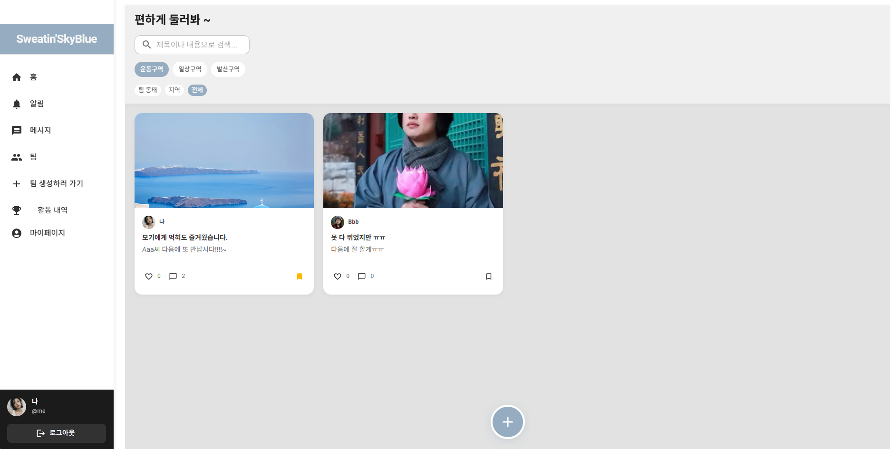

---

### 🔐 인증

#### 로그인

   

#### 회원가입

**공병/기저질환**: 달리기에 부적합한 사람 또는 일정 계획 문제 가능성이 있는 사람을 팀장이 참고할 수 있도록 함

  

---

### 🏃 팀 관리 & 릴레이

#### 1. 팀 생성 (팀장)

팀장 신청은 코스 90% 이상 무결석(신용도 양호) 조건을 충족해야 하며, 경로, 강도, 시간을 직접 설계합니다.

   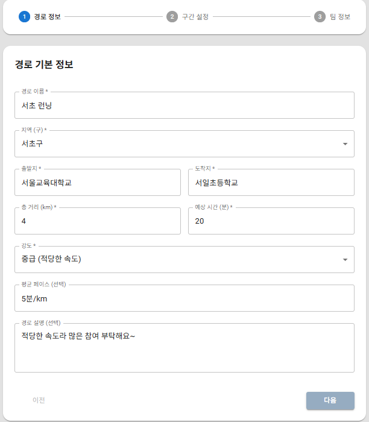

   

   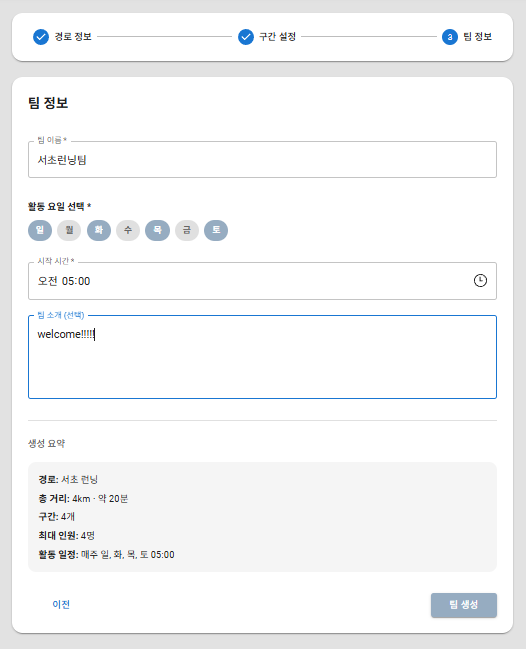

---

#### 2. 팀 가입 (팀원)

**팀 선택 화면**: 기본적으로 자택 근처(구 단위) 팀 표시, 지역/강도별 필터링 가능

   

**팀 상세**: 클릭하면 팀 정보를 확인하고 신청 가능

   

**신청서 작성**: 건강 상태(특히 동반 질환), 직업, 신청 이유, 희망 달리기 구간을 기재

   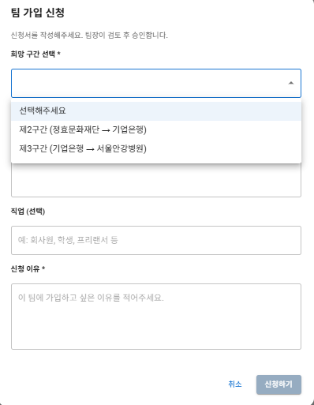

**팀장 승인/거절**: 신청서를 검토하여 승인 또는 거절, 거절 시 사유 전송

   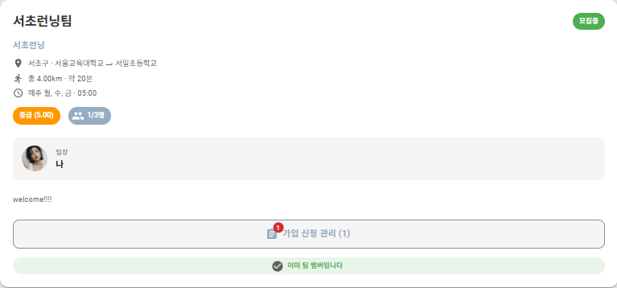

   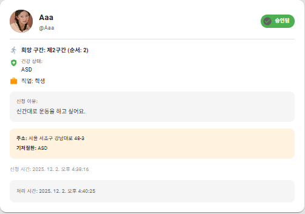

---

#### 3. 릴레이 달리기

**시작**: 마이페이지 → 내 팀/가입된 팀 → 팀 선택

   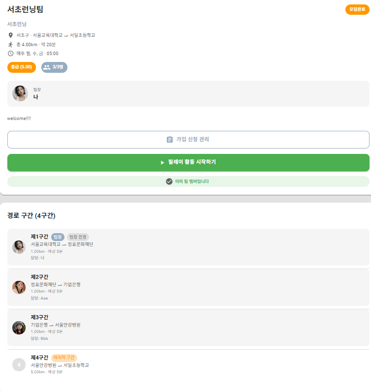

**정상 진행**: 팀장이 시작 버튼 → 릴레이 활동 시작 (팀장이 먼저 혼자 달림)

   

**Skip 기능** (팀장 전용): 지각, 시간 내 미완료 등 의도 외 상황 대응

   

**완료율 변화**: Skip/미완료 시 완료율 하락, 정상 완료 시 완료율 유지/상승

   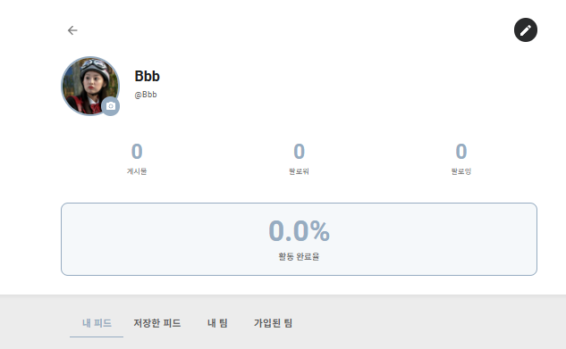
   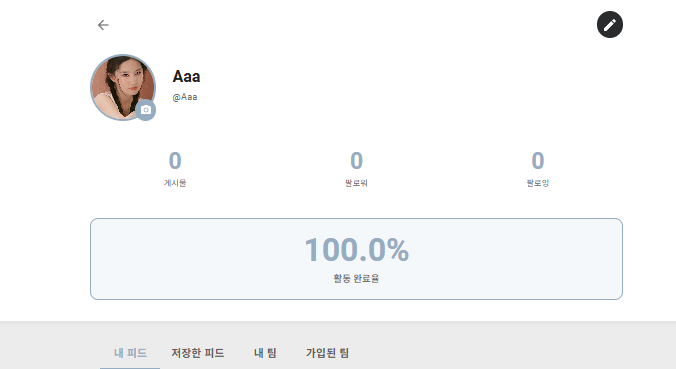

---

### 💬 커뮤니티

#### 피드 - 운동 구역

활동 내역에서 직접 작성 가능

   

**피드 상세**: 함께 달린 사람 자동 표시

   

---

#### 피드 - 발산 구역 (익명 트리홀)

홈 → 하단 "+" → 발산 구역 → 익명 체크

   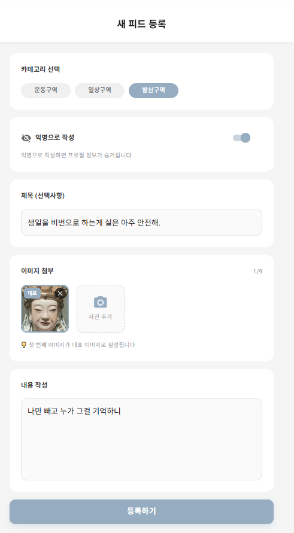

   

---

#### 팀 채팅

팀 모집 완료 후 자동 생성

   

---

### 🔔 알림

   

   

---

### 👤 프로필

#### 프로필 메인

   

---

#### 팔로우 & 채팅

**타인 프로필 방문 시**

   

**팔로우 후**

   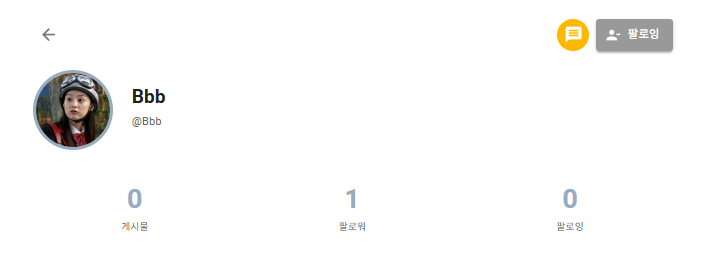

**팔로잉/팔로워 리스트**

   
   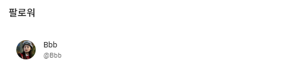

**채팅 생성**: 메시지 버튼 클릭 시 채팅방 생성 (메뉴바의 "메세지"에서 조회)

   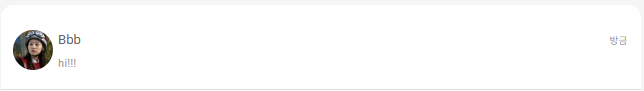

---

#### 프로필 수정

   

---

#### 내 팀 & 가입된 팀

**내 팀**: 팀장이 자신이 만든 팀 조회  
**가입된 팀**: 팀원이 가입한 팀 조회  
**활동 중** 표시로 진행 중인 릴레이 확인 가능

   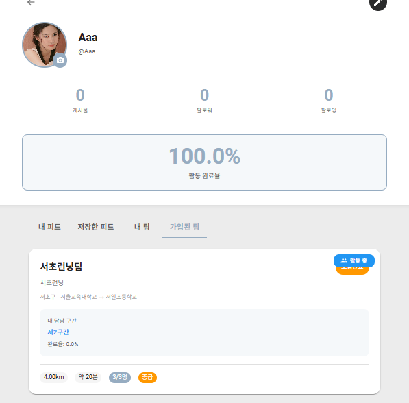

---

## 🐛 알려진 이슈

### 🔴 Critical

1. **서비스 로직상 모바일 앱이어야 함** - 웹 기반의 한계
2. **지도 API 미구현** - 서비스 로직 복잡도로 인한 시간 부족
3. **완료/미완료 구분 오류** - 기록에서 모두 '완료'로 표시됨
4. **익명 피드 응급 조치 기능 없음** - 위기 상황 대응 불가

### 🟡 Important

5. **팀장 권한 부족** - 경로/시간/멤버 수정 불가
6. **팀원 탈퇴 기능 없음**
7. **지역 필터링 하드코딩** - 동적 처리 필요
8. **릴레이 중 알림 미구현**

### 🟢 Minor

9. **비밀번호 찾기 미구현**
10. **개인 인증 없음** - 실명 인증 시스템 부재

---

## 📄 라이선스

이 프로젝트는 개인 포트폴리오용으로 제작되었습니다.

---

## 📧 문의

3228302551@qq.com

---

