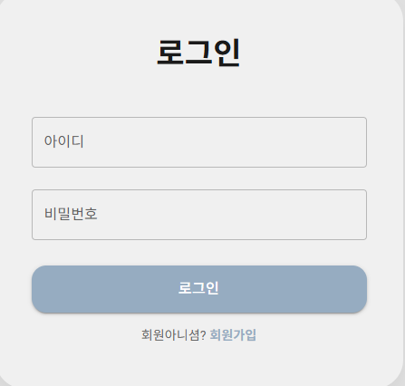

# 🟦🌧️ Sweatin'SkyBlue

## 기능 소개

### 로그인 & 회원가입
---
#### 1.1 로그인 화면

   

#### 1.2 회원가입 화면
- **공병/기저질환**:주요 목적은 달리기에 적합하지 않은 사람과 일정 계획에서 문제가 있을 수 있는 사람을 팀장이 참고할 수 있도록 선별하는 것입니다.

  

### 2. 팀 구성
---

#### 2.1 🏃‍♀️ 팀 구성 (달리기)

<!--
달리기 과정:
- 형식: 주로 릴레이 방식입니다.
- 역할: 전반부는 주자와 동반자입니다. 각 사람은 두 구간을 달립니다. 
        전반부에는 자신이 주자이고 이전 사람이 동반자이며, 
        후반부에는 자신이 동반자가 되고 다음 사람이 주자가 됩니다. 
        즉, 각 개인에게 전반부 역할은 주자, 후반부 역할은 동반자입니다.
- 릴레이 방법: 이전 사람이 중간 지점에 도달하면 다음 사람과 합류하여 릴레이 버튼을 누릅니다. 
             릴레이 버튼을 누르는 순간 다음 사람의 타이머가 시작되고, 
             이전 사람은 동반자가 되며 다음 사람은 주자가 되어 두 사람이 함께 달립니다. 
             다음 사람이 릴레이 버튼을 누를 때 이전 사람은 자신의 달리기 임무를 완료하며, 이렇게 반복됩니다.
- 팀장 권한: 팀장은 과정을 직접 제어할 수 있으며, 다음 사람의 달리기에 영향을 주지 않기 위해 특정 인원을 건너뛰도록 할 권한이 있습니다.
-->

1. **팀의 필터링 및 검색:**  
   홈페이지에는 all/지역/시간대/강도의 필터링 기능과 검색 기능(기본값: 지역)이 있어, 사용자는 이러한 필터를 통해 선택 가능한 팀을 찾을 수 있습니다.
2. **팀 가입 신청 위치:**  
   메뉴 바의 "team"에 있으며, 피드와 유사한 인터페이스로, 기본적으로 자택 근처(구 단위)의 팀들이 카드 형태로 표시됩니다. 또한 사용자가 다른 시/구 및 시간대(2시간 단위)를 선택하여 필터링할 수 있는 선택 옵션이 있습니다.
3. **팀 카드:**  
   각 팀에는 카드가 있습니다. 카드 내용: 구 이름, 출발지 이름, 도착지 위치, 시작 시간, 종료 시간, 팀 인원 수, 강도 수준(전체 완주 평균 속도입니다. 구현 방법이 고민됩니다. 직선 거리가 아닌 실제 경로 거리/시간이 필요할 텐데, 어떤 API를 사용해야 할지, 구현이 어려울지 모르겠습니다).  
   카드 해당 위치에 "팀 가입하기" 버튼이 있으며, 클릭하면 신청 절차가 시작되고 팀장의 승인 후 팀에 합류할 수 있습니다.
4. **신청서 작성:**  
   자신의 건강 상태(특히 동반 질환), 이름, 나이, 성별(자동 입력), 직업, 신청 이유(textarea), 희망 달리기 구간(option)을如实 기재합니다.
5. **각 구간 인원 제한:**  
   각 구간은 2명을 초과할 수 없으며, 모든 구간의 인원이 충원되어야 달리기를 시작할 수 있습니다. 과정은 다음과 같습니다: 먼저 팀장이 달리기 시작하여 중간 지점에 도달하면 릴레이 버튼을 누릅니다. 다음 사람의 타이머는 그때부터 시작되며, 팀장은 그 사람이 자신의 중간 지점(팀장의 종점)에 도달할 때까지 동반합니다. 그 중간 지점에서 또 다음 사람을 만나 그 사람의 중간 지점까지 동반하며, 이 과정이 마지막 사람이 완주할 때까지 반복됩니다.
6. **신청 승인:**  
   팀장은 신청서를 검토하여 승인 또는 거절합니다. 승인 전 상태는 '검토 중'이며, 승인되면 해당 인원이 팀에 합류합니다. 거절 시 거절 사유가 전송됩니다.
7. **팀장 신청 (팀 생성):**  
   달리기 팀의 팀장 신청은 코스 90% 이상 무결석(신용도 양호) 조건을 충족해야 합니다. 또한 자신이 경로, 강도, 시간을 직접 설계해야 합니다.

### 채팅 그룹

1. 채팅 그룹은 다중 사용자 채팅 그룹입니다.
2. **【선택사항】** 다중 채팅 그룹을 통해 특정 팀원과 개별적으로 친구를 추가하고, 개별 채팅방을 열 수 있습니다.

---

## 개인 홈페이지, SNS 공유 (홈페이지/피드)

### 개인 홈페이지

1. **(필수)** 코스 완료율 공개
2. 공개해도 무방한 기본 정보 및 상태 메시지: 닉네임, 생일, 성별, 나이, 직업 (닉네임 외 정보는 공개하지 않아도 무방)
3. 내 노트(피드), 북마크한 노트
4. 친구 목록 (친구 추가, 언팔로우)
5. 소속 팀
6. 알림 (채팅 알림, 노트 좋아요/댓글 알림)
7. 팀장의 경우 추가 항목: 내 팀

`tbl_feed`, `tbl_feed_img`, `tbl_feed_like`, `tbl_feed_favorite`, `tbl_comment` 와 같은 테이블 구조가 필요합니다.

### SNS 공유 노트 (홈페이지/메인 피드)

홈페이지의 주요 기능은 두 가지입니다: 첫째는 팀 구성 기능, 둘째는 노트 자유롭게 탐색 기능입니다.

1. **노트 목록 검색 및 필터링:**  
   공유 구역, 일상 구역, 감정 배출 구역(사용자가 익명 또는 반익명으로 부정적 감정 작성 가능)으로 나뉩니다. 기본값은 공유 구역이며, 지역/공유·일상·배출 구분/팀원 동태(기본값)로 필터링할 수 있습니다.
2. **좋아요 및 북마크:**  
   좋아요는 숫자로만 표시되며, 북마크는 북마크 노트 폴더에 저장됩니다.
3. **노트 작성:**  
   "+" 버튼 클릭 시 직접 노트 작성 가능.
4. **댓글 기능:**  
   기본적인 댓글 기능 제공.

---

## 달리기 실행

1. **【선택사항】** 달리기 팀 활동 종료 후, 완료 시 노트 작성 초대가 자동으로 표시됩니다. 달리기 노트에는 "누가 나와 함께 달렸나" 항목이 추가되며, 당분간은 직접 선택하여 표시할 수 있습니다.
2. 이러한 결과는 완료율에 직접 반영됩니다.

---

## 현재 문제점 (이슈)

1. 팀장이 경로, 시간, 멤버를 수정할 수 있는 기능이 없습니다.
2. 팀원이 팀을 탈퇴할 수 있는 버튼이 없습니다.
3. 지도 API를 사용하고 싶으나, 서비스 로직이 너무 복잡하여 시간 내 완성하기 어렵습니다.
4. 완료/미완료 사용자가 기록에서 모두 '완료'로 표시되는 문제가 있습니다.
5. 지역 필터링이 일단 하드코딩된 상태입니다.
