# 🟦🌧️ Sweatin'SkyBlue

**팀 릴레이 조깅을 통해 우울증 환자들이 운동 습관을 형성하고 심리적 부담을 줄일 수 있도록 돕는 상호 지원 커뮤니티 플랫폼**

**개발 기간**: 2025.11.25 ~ 2025.12.02 (8일, 1인 풀스택 개발)

---

## 📖 목차

- [프로젝트 소개](#-프로젝트-소개)
- [핵심 기능](#-핵심-기능)
- [기술 스택](#-기술-스택)
- [개발 과정 및 문제 해결](#-개발-과정-및-문제-해결)
- [주요 화면](#-주요-화면)

---

## 💡 프로젝트 소개

### 왜 이 서비스를 만들었나요?

조깅은 많은 연구에서 우울증 핵심 치료법으로 권고되지만, 환자들은 개인 의지력만으로 운동 습관을 유지하기 어렵습니다. **Sweatin'SkyBlue**는 릴레이 조깅 시스템으로 강제성과 동반자 효과를 제공하며, 익명 커뮤니티로 낙인 없이 감정을 표현할 수 있는 안전한 공간을 만듭니다.

### 🎯 핵심 설계 원칙

- ✅ **효과적이고 저렴하며 접근 가능** - 조깅의 강력한 항우울 효과 활용
- ✅ **환자 특성에 맞춤** - 심리적 투여 최소화, 이전 주자 도착 시 다음 주자 출발
- ✅ **낙인 감소** - 비슷한 경험을 가진 사람들과 익명 트리홀 기능
- ✅ **선택의 자유 존중** - 어떠한 인지적/이념적 틀도 강요하지 않음

---

## 🔧 기술 스택

**개발 기간**: 2025.11.25 ~ 2025.12.02 (8일)

### Frontend

| 기술명 | 설명 |
|--------|------|
|  | React 18.3.1 - 최신 React 기능을 활용한 컴포넌트 기반 개발 |
|  | Material-UI 6.1.5 - 일관된 UI 컴포넌트 라이브러리 |
|  | React Router 6.27.0 - 클라이언트 사이드 라우팅 |
|  | Socket.io-client 4.8.1 - 실시간 채팅 WebSocket 클라이언트 |
|  | jwt-decode 4.0.0 - JWT 토큰 디코딩 |

### Backend

| 기술명 | 설명 |
|--------|------|
|  | Node.js 24.11.1 - 비동기 이벤트 기반 서버 런타임 |
|  | Express 5.1.0 - 간결한 웹 프레임워크 |
|  | MySQL 8.0 - 관계형 데이터베이스 |
|  | Socket.io 4.7.2 - 실시간 채팅 WebSocket 서버 |
|  | JWT 9.0.2 - 토큰 기반 인증 |
|  | bcrypt 6.0.0 - 비밀번호 해싱 (saltRounds: 10) |
|  | Multer 2.0.2 - 파일 업로드 처리 |

### 외부 API

| 기술명 | 설명 |
|--------|------|
|  | Daum 우편번호 API - 주소 검색 서비스 |

---

## 🚀 핵심 기능

### 1. 🏃 릴레이 조깅 시스템

**이전 주자 도착 → 다음 주자 출발**하는 릴레이 구조로 개인 의지력 의존도를 낮춥니다.

- **역할 전환**: 주자 → 동반자로 전환되며 함께 달림
- **팀장 Skip 기능**: 지각/미완료 시 다음 주자에게 영향 없이 진행
- **완료율 시스템**: 신용도 지표로 활용 (팀장 자격 90% 이상)
- **React State 기반 상태 관리**: useState, useEffect로 타이머 및 역할 전환 구현

   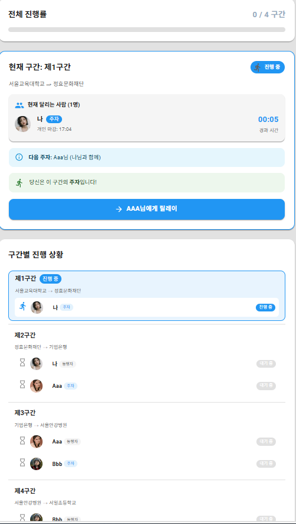
  &nbsp;&nbsp;&nbsp;&nbsp;&nbsp;&nbsp;&nbsp;&nbsp;&nbsp;&nbsp;
   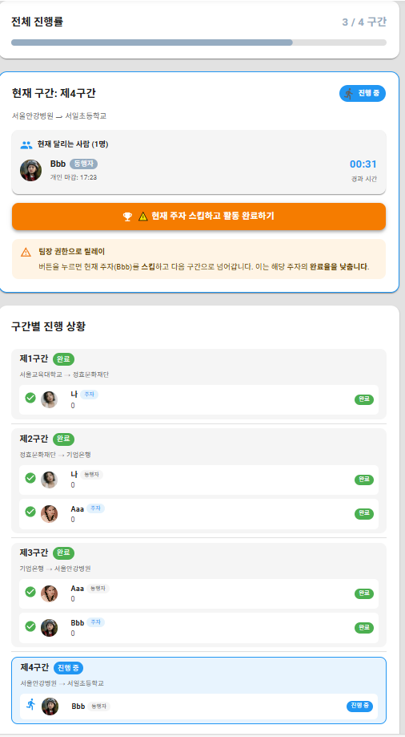

### 2. 📝 3개 구역 커뮤니티 피드

- **운동 구역**: 활동 기록 공유, 함께 달린 팀원 자동 표시
- **일상 구역**: 일상 경험 자유롭게 공유
- **발산 구역 (익명)**: 낙인 없이 부정적 감정 표현 가능한 트리홀

**기능**: 좋아요, 댓글, 북마크, 수정/삭제, 지역/구역별 필터링, 검색

   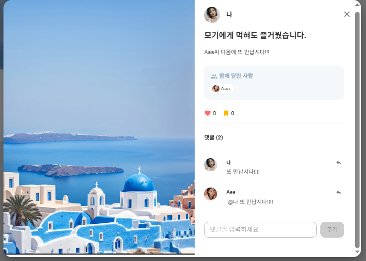
     &nbsp;&nbsp;&nbsp;&nbsp;&nbsp;&nbsp;&nbsp;&nbsp;&nbsp;&nbsp;
   

### 3. 👥 팀 관리

**팀 생성 (팀장)**
- 완료율 90% 이상 자격 조건
- 경로, 강도, 시간, 최대 인원 직접 설계
- 각 팀원에게 구간 배정

**팀 가입 (팀원)**
- 지역(Daum 우편번호 API)/강도별 필터링
- 신청서: 건강 상태, 직업, 신청 이유, 희망 구간
- 팀장 승인/거절 시스템

   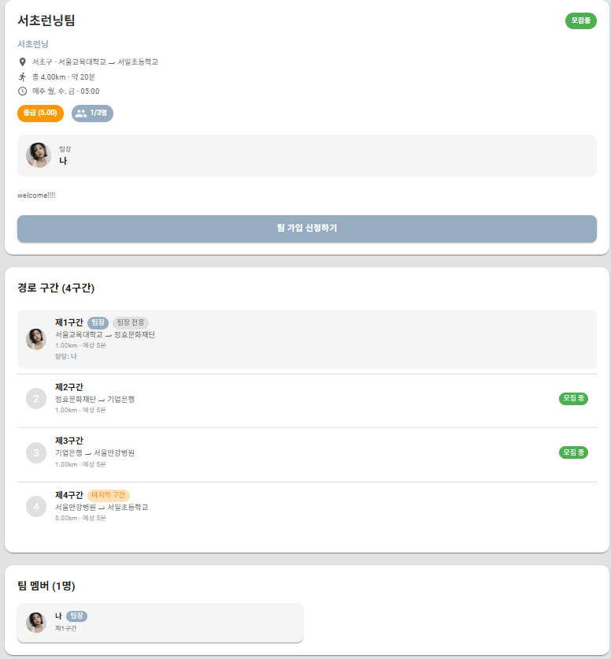

### 4. 💬 실시간 통신

**Socket.io 4.8.1 WebSocket 기반**
- 팀 채팅 (팀 모집 완료 후 자동 생성)
- 1:1 채팅 (프로필에서 메시지 버튼)
- 실시간 알림 (좋아요, 댓글, 팔로우, 팀 가입 신청/승인)

   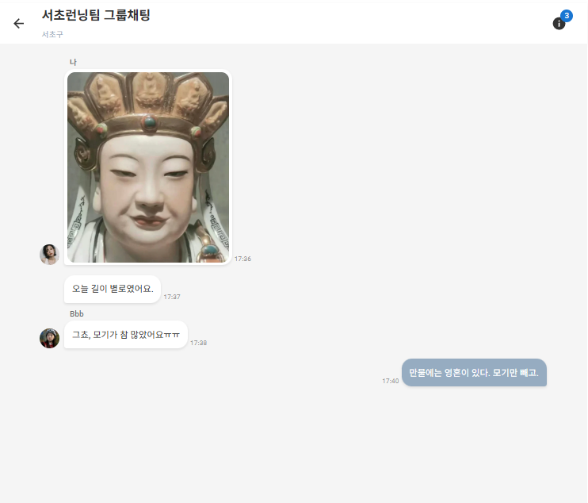

### 5. 👤 프로필 & 소셜 기능

- 팔로우/팔로워 시스템
- 완료율 표시 (신용도 지표)
- 내 팀 / 가입된 팀 조회
- 저장한 피드 모아보기

   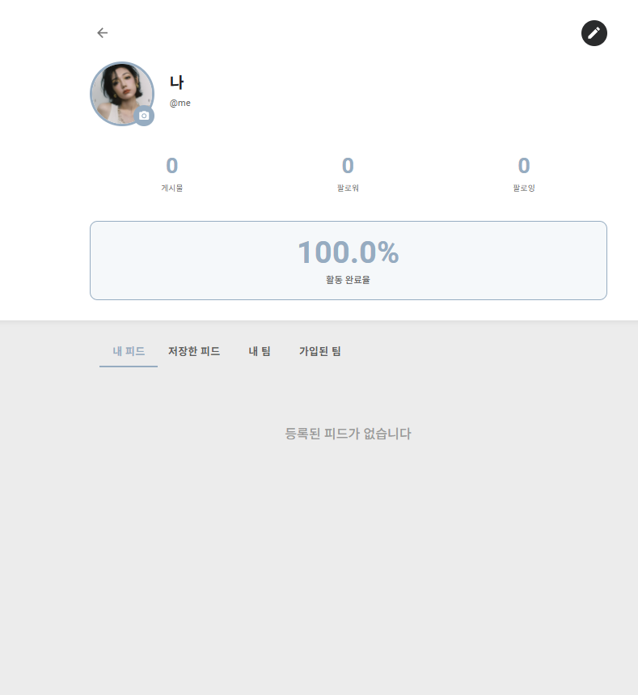

---

## 📱 주요 화면

### 🔐 회원가입 & 로그인

**JWT 토큰 기반 인증**, bcrypt 비밀번호 해싱, Daum API 주소 검색

   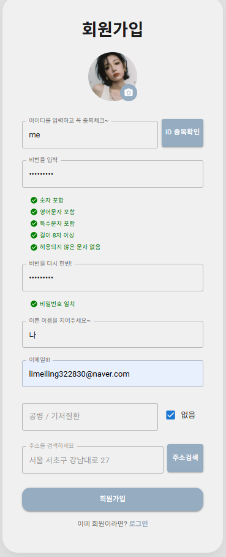
   

### 🏃 팀 생성 & 가입

   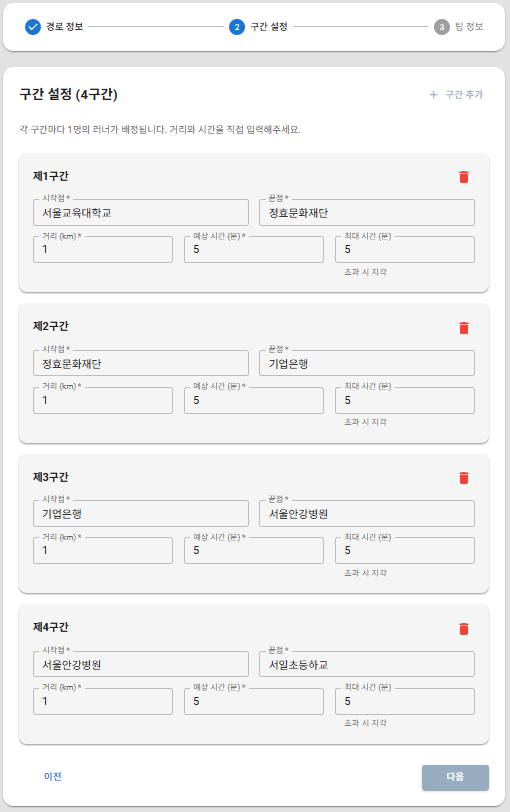
   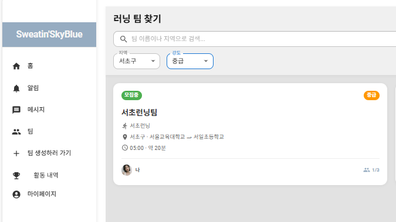

### 💬 커뮤니티 & 알림

   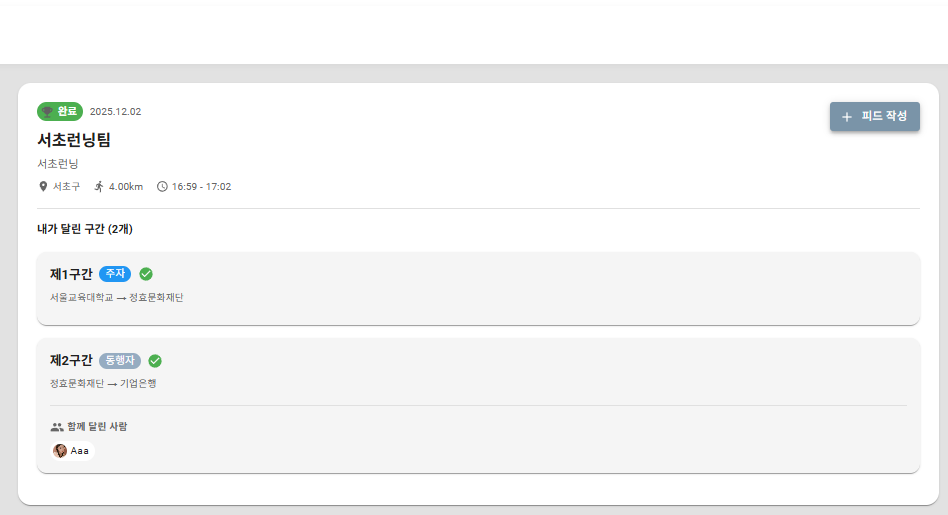
   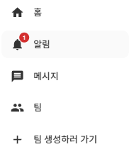

---

## 🔧 개발 과정 및 문제 해결

초기 단순한 테이블 구조로는 릴레이 조깅의 복잡한 비즈니스 로직을 관리하는 데 한계를 느꼈고, 개발 과정에서 불필요한 시행착오로 시간이 낭비되었습니다. 이를 해결하기 위해 릴레이 과정을 시나리오 단위로 다시 정리하고, 각 필드의 역할과 필요성을 재검토하며 데이터 구조를 정비했습니다. 이 과정을 통해 BD의 구조가 많히 복잡해졌지만 필요한 노력이었다고 생각합니다. 요구사항 분석의 중요성과 초기 설계 단계에서 확장성을 고려해야 한다는 점을 명확히 인식하게 되었습니다.

---

## 📧 문의

lmeiling322830@gmail.com

---

## 📄 라이선스

이 프로젝트는 개인 포트폴리오용으로 제작되었습니
